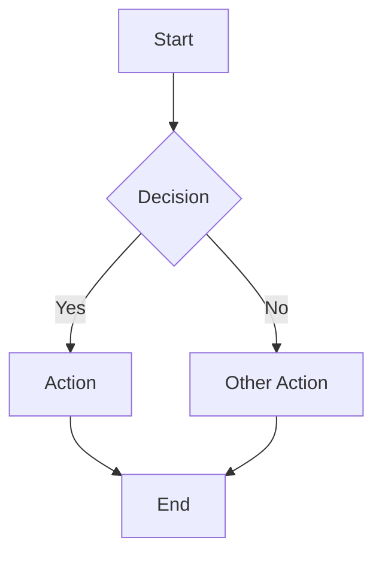

# 🧜‍♀️ Mermaid to Image Converter

A client-side web app that renders Mermaid diagrams and exports them as SVG, PNG, or JPEG.

**Everything runs in your browser** — no server, no uploads, no dependencies to install.

## Features

- ✏️ Live editor with real-time preview (400ms debounce)
- 🎨 Theme selection (Default, Dark, Forest, Neutral)
- 🖼️ Background options (Transparent, White, Dark)
- ⬇️ Export to SVG, PNG, or JPEG
- 📋 Copy SVG to clipboard
- 🔍 Scale control (1x–4x) for high-resolution raster exports
- ⌨️ Keyboard shortcuts (Cmd+Enter to render, Cmd+S to save SVG)
- 📱 Responsive layout (works on mobile)
- 🔒 Privacy — nothing leaves your browser

## Usage

### Open Locally

Just open `index.html` in your browser:

```bash
open index.html
```

Or serve with any static file server:

```bash
npx serve .
# → http://localhost:3000
```

### Write a Diagram

Paste or type Mermaid code in the editor panel. The diagram renders automatically.



### Export

1. Choose your theme and background
2. Set the scale (2x recommended for presentations)
3. Click SVG, PNG, or JPEG to download

## Supported Diagram Types

All Mermaid diagram types are supported:

- Flowcharts (`flowchart TD/LR`)
- Sequence diagrams (`sequenceDiagram`)
- Class diagrams (`classDiagram`)
- State diagrams (`stateDiagram-v2`)
- Entity-Relationship (`erDiagram`)
- Gantt charts (`gantt`)
- Pie charts (`pie`)
- Git graphs (`gitGraph`)
- Mindmaps (`mindmap`)
- Timeline (`timeline`)
- And more — see [Mermaid docs](https://mermaid.js.org/intro/)

## Tech Stack

- [Mermaid.js v11](https://mermaid.js.org/) — diagram rendering
- Vanilla HTML/CSS/JS — no framework, no build step
- ES Modules — modern browser import
- Canvas API — raster export (PNG/JPEG)

## Keyboard Shortcuts

| Shortcut | Action |
|----------|--------|
| `Cmd/Ctrl + Enter` | Render immediately (skip debounce) |
| `Cmd/Ctrl + S` | Export as SVG |

## License

MIT
