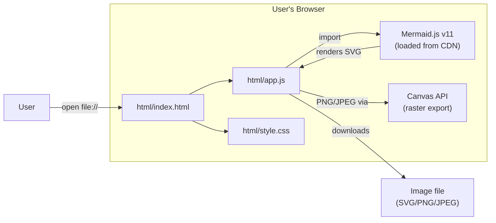
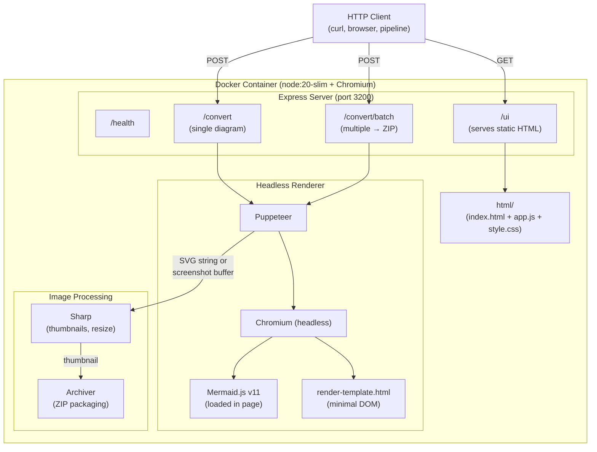
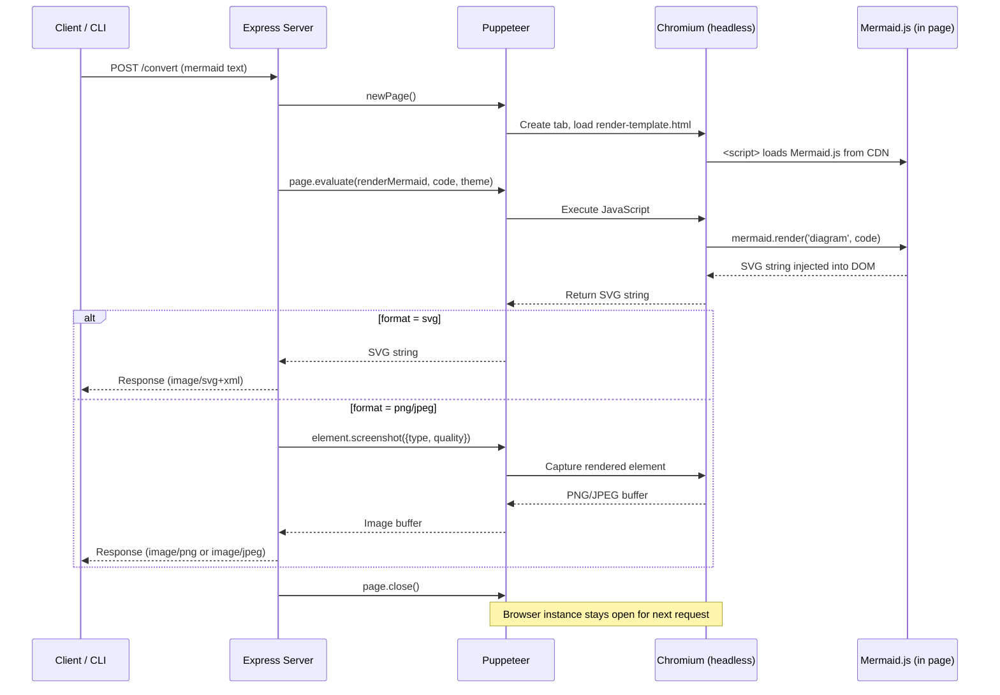
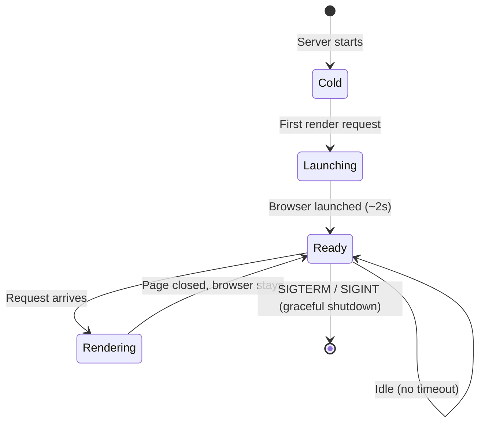
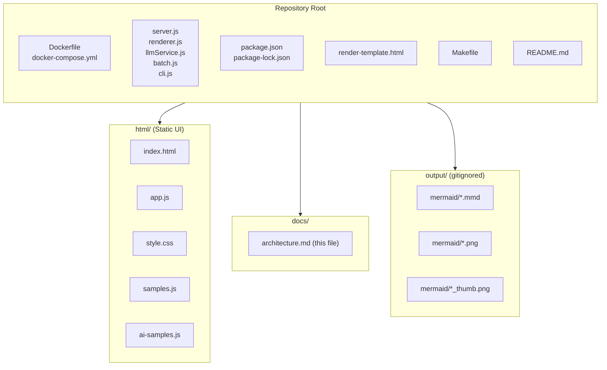
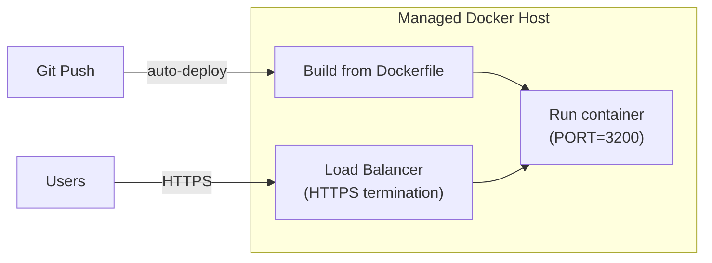
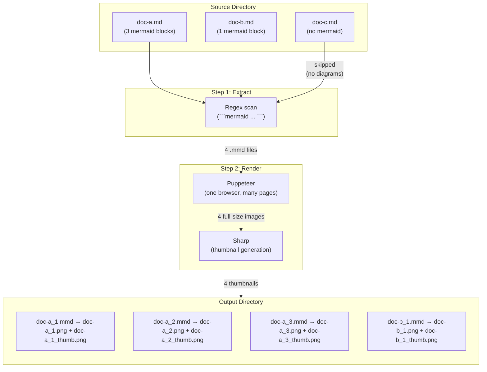

# Architecture — Mermaid-to-Image Converter

**Date:** July 2026  
**Version:** 2.0.0  

---

## Overview

The Mermaid-to-Image Converter is designed around a core principle: **two deployment modes from one codebase, each optimized for a different use case.**

1. **Static HTML mode** — Zero dependencies, opens from the filesystem, runs entirely in the browser. For individual diagram editing and quick exports.

2. **Containerized API mode** — Node.js server with headless Chromium. For batch conversion, automation pipelines, and hosted deployment. Includes the static UI as a served route.

Both modes render diagrams with Mermaid.js v11. The browser UI uses the browser's native rendering engine; the API uses Puppeteer (headless Chromium) to achieve identical output programmatically.

---

## Mode 1: Static HTML (Browser-Only)



### How It Works

1. User opens `html/index.html` directly from the filesystem (`file://` protocol)
2. The browser loads `app.js` and `style.css` from the same directory
3. Mermaid.js is fetched from the jsDelivr CDN (`https://cdn.jsdelivr.net/npm/mermaid@11`)
4. User types or pastes a diagram in the editor textarea
5. After 500ms of inactivity, `app.js` calls `mermaid.render()` to produce SVG
6. SVG is displayed in the preview panel
7. On export:
   - **SVG:** SVG string encoded as a data URI → triggers download
   - **PNG/JPEG:** SVG drawn to a hidden `<canvas>` at the selected scale → `canvas.toDataURL()` → triggers download

### Key Characteristics

| Property | Value |
|----------|-------|
| Server required | No |
| Dependencies to install | None |
| Build step | None |
| Internet required | Only for initial Mermaid.js CDN load |
| Works offline | Yes (after first load, browser caches CDN script) |
| Deployment | Copy 3 files anywhere |
| Rendering engine | Browser's native DOM + SVG |

### Limitations

- Single diagram at a time (manual paste + export)
- No batch processing
- No programmatic access (no API)
- No thumbnails (single export size)
- Requires a modern browser (ES2017+)

---

## Mode 2: Containerized API (Node.js + Puppeteer)



### How It Works

**Single conversion (`POST /convert`):**

1. Client sends raw Mermaid text in the request body
2. Server opens a new Puppeteer page (reuses a persistent browser instance)
3. Page loads `render-template.html` — a minimal HTML file with Mermaid.js
4. Server calls `page.evaluate()` to render the diagram → SVG string
5. For SVG: returns the SVG directly
6. For PNG/JPEG: uses Puppeteer's `element.screenshot()` at the requested scale
7. Page is closed (browser stays open for the next request)

**Batch conversion (`POST /convert/batch`):**

1. Client sends a JSON array of `{name, content}` objects
2. Server iterates, rendering each diagram (reusing the browser)
3. For each: full-size image + thumbnail (via Sharp resize)
4. All files packaged into a ZIP stream (Archiver)
5. ZIP returned as response

**CLI batch (`node cli.js`):**

1. Scans a source directory recursively for `.md` files
2. Extracts ` ```mermaid ` blocks using regex
3. Writes each block to `{target}/mermaid/{filename}_{n}.mmd`
4. Renders each `.mmd` through the same Puppeteer renderer
5. Generates full-size image + thumbnail for each
6. Reports progress and errors

### Rendering Pipeline Detail



### Browser Instance Lifecycle



The browser is launched lazily on first request and kept alive for the server's lifetime. Each render opens a new page (~50ms) rather than launching a new browser (~2s). This amortizes the startup cost across all requests.

### Key Characteristics

| Property | Value |
|----------|-------|
| Server required | Yes (Node.js 20+) |
| Dependencies | express, puppeteer, sharp, archiver |
| Rendering engine | Chromium via Puppeteer (identical to browser rendering) |
| Batch capable | Yes (CLI or API) |
| Thumbnails | Yes (Sharp, configurable width) |
| Docker ready | Yes (Dockerfile + docker-compose at repo root) |
| Ports | 3200 (API + UI) |
| Scales to | Concurrent requests (one browser, many pages) |

---

## Project Structure



---

## Deployment Options

### Option 1: Filesystem (Static UI Only)

```bash
open html/index.html
```

No server, no install. Copy the `html/` folder to any machine with a browser.

### Option 2: Local Development (make dev-up)

```bash
make dev-up
# API: http://localhost:3200
# UI:  http://localhost:3200/ui
```

Runs `node server.js` as a background process. Requires Node.js 20+ and `npm install`.

### Option 3: Docker (make docker-up)

```bash
make docker-up
# API: http://localhost:3200
# UI:  http://localhost:3200/ui
```

Builds a container with Node.js + system Chromium. No local Node.js required. Suitable for hosted environments (Render, Railway, ECS, etc.).

### Option 4: Managed Docker Hosting

The `Dockerfile` and `docker-compose.yml` are at the repository root, which is the expected location for managed platforms:

| Platform | Detection | Config Needed |
|----------|-----------|---------------|
| Render | Auto-detects `Dockerfile` at root | Set port = 3200 |
| Railway | Auto-detects `Dockerfile` at root | None |
| Fly.io | `fly launch` reads Dockerfile | Set internal port |
| AWS ECS | Push image to ECR, create task def | Standard Fargate setup |
| Google Cloud Run | `gcloud run deploy --source .` | None |



---

## Technology Decisions

| Decision | Choice | Rationale |
|----------|--------|-----------|
| Rendering (API) | Puppeteer (headless Chromium) | Full DOM fidelity, identical to browser rendering |
| Thumbnails | Sharp | Fast native image processing, no external tools |
| ZIP packaging | Archiver | Streaming ZIP creation, memory-efficient |
| HTTP framework | Express | Lightweight, no opinions, battle-tested |
| Static UI | Vanilla HTML/JS/CSS | Zero build step, works from filesystem |
| Mermaid version | v11 (CDN) | Same version in browser and headless — rendering parity |
| Base image | node:20-slim + system Chromium | Smaller than puppeteer's bundled Chromium |
| Container OS | Debian slim | Required for Chromium system dependencies |

---

## Data Flow: Batch Conversion Pipeline



### Output Naming Convention

| Source File | Block # | Outputs |
|-------------|:-------:|---------|
| `mlops-process-flow.md` | 1 | `mlops-process-flow_1.mmd`, `.png`, `_thumb.png` |
| `mlops-process-flow.md` | 2 | `mlops-process-flow_2.mmd`, `.png`, `_thumb.png` |
| `data-science-lifecycle.md` | 1 | `data-science-lifecycle_1.mmd`, `.png`, `_thumb.png` |

Thumbnails are 400px wide by default — sized for embedding in Google Docs, Confluence, or email while linking to the full-size image.

---

## Security Considerations

| Concern | Mitigation |
|---------|-----------|
| Mermaid code injection | Mermaid.js runs with `securityLevel: 'loose'` but only in a headless browser with no network access to internal services |
| Arbitrary code execution | Puppeteer pages are isolated; no `--no-sandbox` in production Docker (runs as non-root) |
| Resource exhaustion | Express body size limited to 1MB (single) / 10MB (batch) |
| Container escape | Standard Docker isolation; no privileged mode |
| Data persistence | Stateless — no data stored between requests; output directory is ephemeral |

---

## Performance Characteristics

| Operation | Typical Duration |
|-----------|:----------------:|
| Browser launch (cold start) | ~2 seconds |
| Single SVG render | ~100–200ms |
| Single PNG render (2x scale) | ~300–500ms |
| Thumbnail generation | ~50ms |
| Batch of 44 diagrams (PNG + thumbs) | ~25–35 seconds |
| Page open/close overhead | ~50ms |

The browser launches once and stays resident. Subsequent renders reuse it, making per-diagram cost ~200–500ms regardless of batch size.
